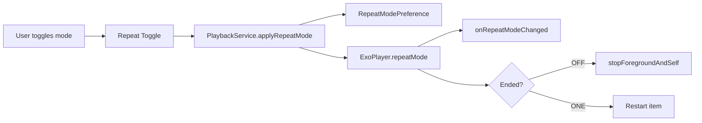
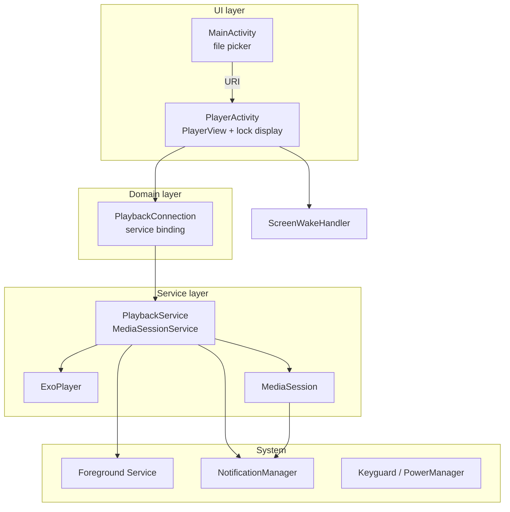
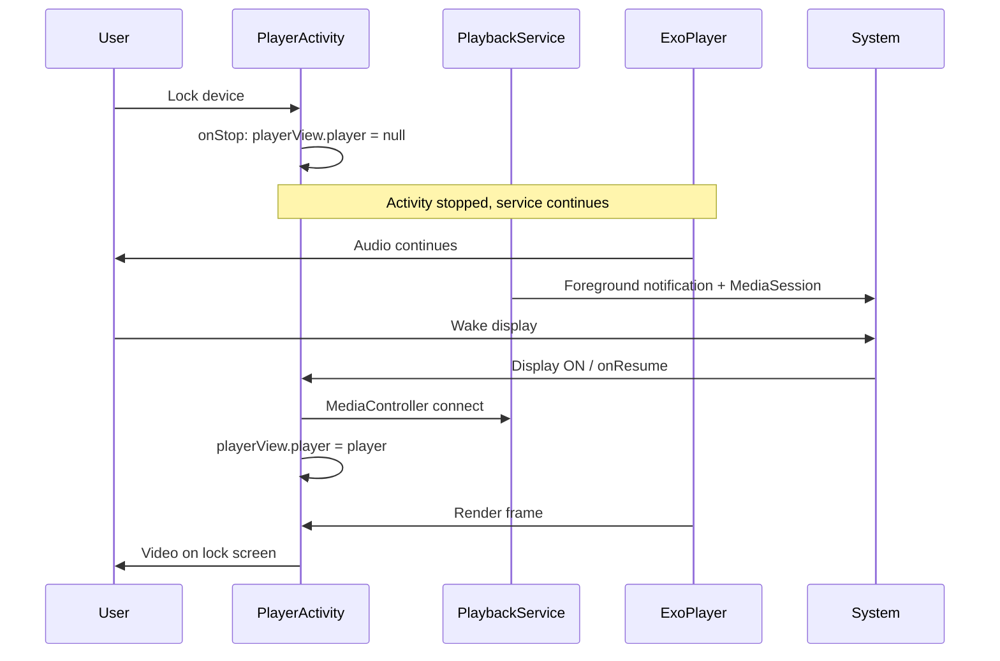
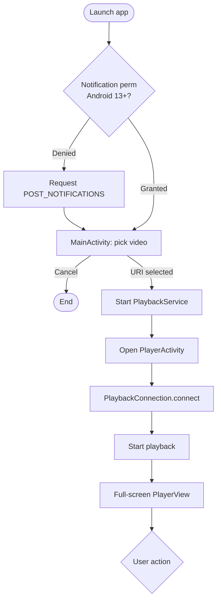
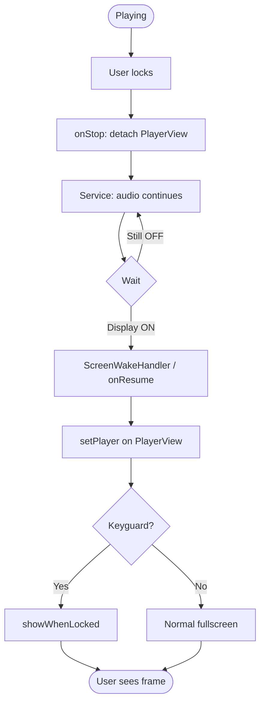
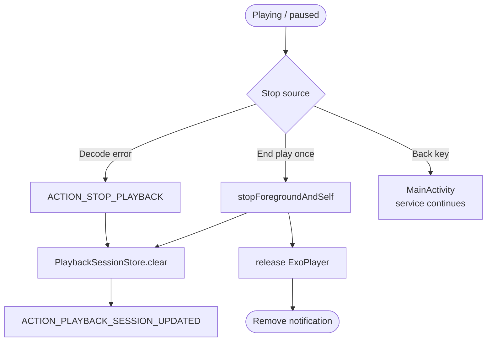
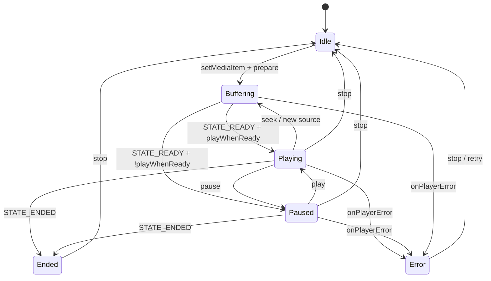
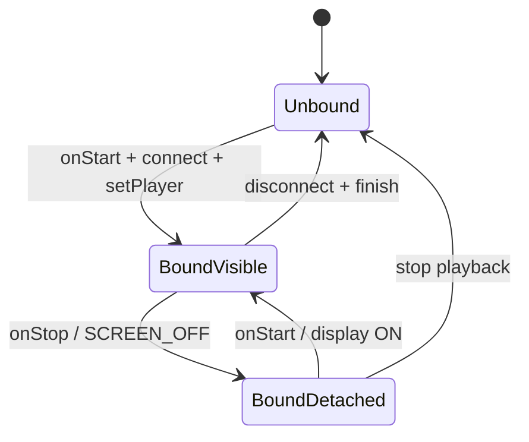
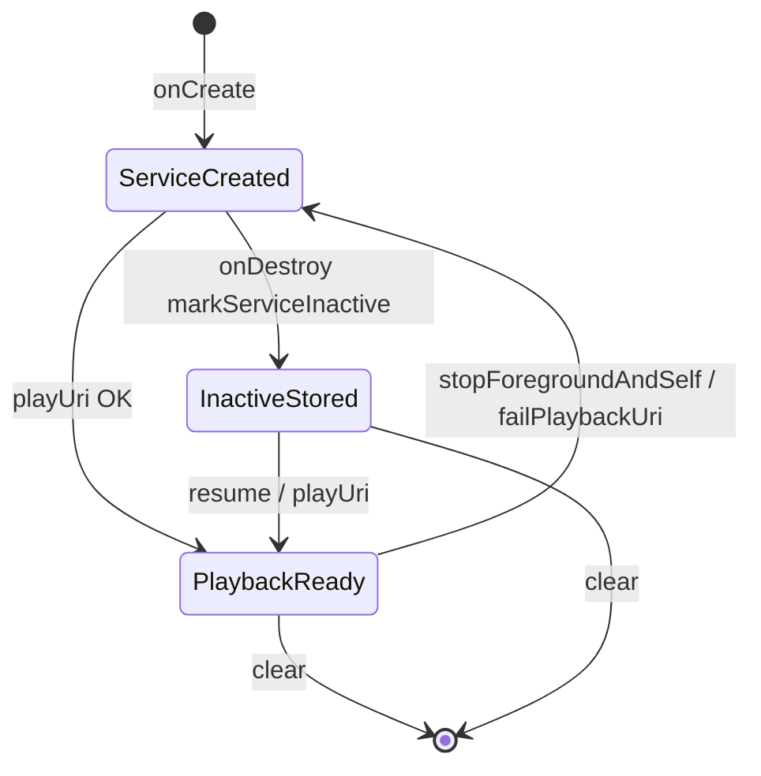
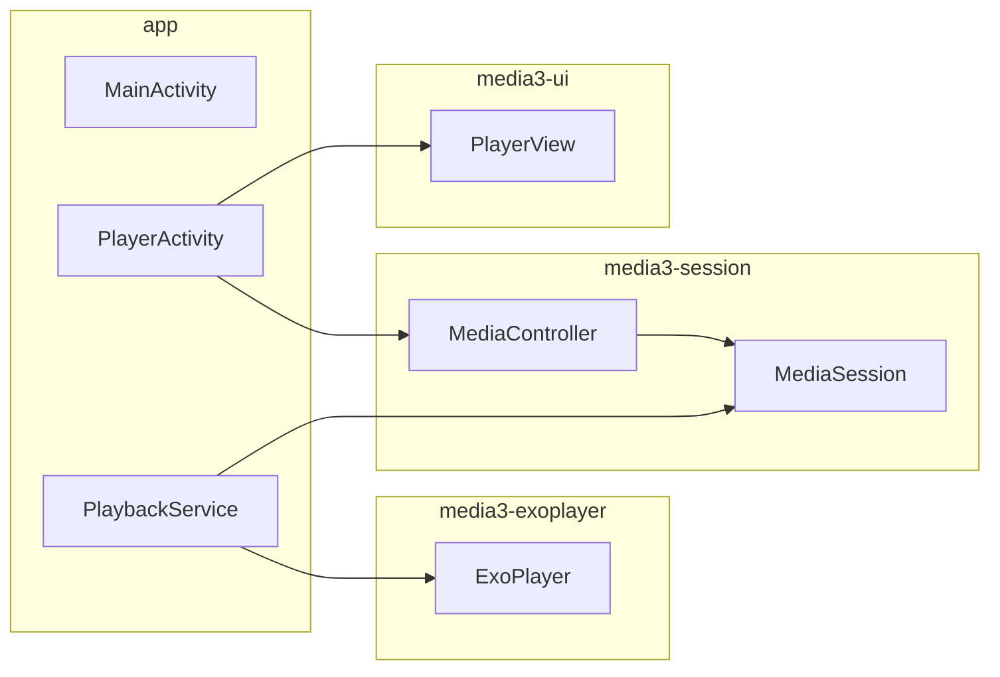

# LockScreenPlayer Functional Specification

> Last updated: 2026-05-20 (aligned with v0.1.0 implementation)  
> Platform: Android 8.0+ (**minSdk 26** / targetSdk 35 / compileSdk 36)

---

## 1. Product overview

### 1.1 Positioning

This app is a **local video media player** with two core experiences:

1. **Audio continues after lock screen**: Pressing the power button to lock does not stop playback audio.
2. **Video visible when waking the screen**: While still behind the keyguard, waking the display shows the current video frame (not live lock screen wallpaper, not inline video in the notification).

### 1.2 Out of scope (v1.0)

| Item | Notes |
|------|-------|
| Live video on lock screen wallpaper | OS does not allow third-party live video on wallpaper layer |
| Live video inside lock screen notification | MediaStyle notifications support static artwork only |
| Full keyguard bypass for controls | Seek and similar actions may require unlock (configurable) |
| Online streaming / DRM | v1.0 local files only (`content://`, `file://`) |
| iOS / cross-platform | Android only |

### 1.3 Use cases

- Language-learning or podcast-style video with screen off to save power.
- Glance at the current frame after wake without full unlock.

---

## 2. Functional requirements

### 2.1 MoSCoW feature list

| Priority | ID | Feature | Description |
|----------|-----|---------|-------------|
| **Must** | F-01 | Local video pick and play | Open video from system document picker |
| **Must** | F-02 | Audio on lock screen | Playback continues via foreground service + MediaSession |
| **Must** | F-03 | Wake screen restores video | Show current frame on lock screen when display turns on |
| **Must** | F-04 | Media notification and lock controls | Play/pause/stop; title and static artwork |
| **Should** | F-05 | Full-screen player on lock screen | `setShowWhenLocked(true)` |
| **Should** | F-06 | Audio focus | Follow Android audio focus rules |
| **Should** | F-10 | Repeat mode | Play once / repeat one; preference persisted |
| **Should** | F-11 | Resume playback and session recovery | Persist URI/title; recover after process restart if URI still readable |
| **Could** | F-07 | Remember playback position | DataStore persistence |
| **Could** | F-08 | Double-tap wake shortcut to player | Device-dependent |
| **Won't** | F-09 | PiP as lock screen preview | Unreliable when locked |

### 2.2 Detailed behavior

#### F-02 Audio continues on lock screen

| Item | Spec |
|------|------|
| Trigger | Power button, auto screen timeout |
| Expected | `PlaybackService` keeps running; `ExoPlayer` not `release`d on Activity `onStop` |
| Activity | `PlayerActivity.onStop` only clears `PlayerView` binding, does not call `player.stop()` |
| Exceptions | User stops from notification, process killed, permanent audio focus loss |
| Notification | Foreground service notification; Android 13+ needs `POST_NOTIFICATIONS` |

#### F-03 Wake screen restores video

| Item | Spec |
|------|------|
| Trigger | `DisplayManager.DisplayListener` (default display `STATE_ON`); plus `ACTION_SCREEN_OFF` |
| Reinforcement | `PlayerActivity.onResume`, `onWindowFocusChanged(true)` call `attachPlayerToView()` |
| Expected | Re-bind `MediaController` to `PlayerView` at `currentPosition` |
| Display | `setShowWhenLocked(true)`; `setTurnScreenOn(false)` |
| Screen OFF | `playerView.player = null`; audio from service `ExoPlayer` |
| Fallback | Notification controls remain; log if needed |

#### F-04 Media notification

| Control | Behavior |
|---------|----------|
| Play/pause | MediaSession toggles `playWhenReady` |
| Stop | End (play once) or `ACTION_STOP_PLAYBACK` → `stopForegroundAndSelf()` → `clear()` session |
| Tap notification / lock card | `SessionTrampolineActivity` (URI check) → `PlayerActivity` or `MainActivity` |
| Artwork | First frame in `MediaMetadata.artwork` |
| Channel | `IMPORTANCE_DEFAULT` + `VISIBILITY_PUBLIC` for lock screen |

#### F-10 Repeat mode

| Mode | ExoPlayer `repeatMode` | Behavior |
|------|------------------------|----------|
| Play once | `REPEAT_MODE_OFF` | Stop at end |
| Repeat | `REPEAT_MODE_ONE` | Restart same item when ended |

| Item | Spec |
|------|------|
| UI | `MaterialButtonToggleGroup` on `PlayerActivity` |
| Persistence | `RepeatModePreference` (SharedPreferences) |
| Sync | UI sends `PlaybackService.setRepeatModeIntent`; **only Service** writes preference |
| Connected | Toggle updated via `onRepeatModeChanged`; optimistic UI when disconnected |
| Lock screen | Mode held by service `ExoPlayer` |



#### F-11 Resume playback and session

| Item | Spec |
|------|------|
| Persistence | SharedPreferences `playback_session`: URI string, title, `service_active` |
| Restore on launch | `LockScreenPlayerApp` → `PlaybackSessionStore.restore()` |
| Resume button | Background `UriPlaybackAccess.canReadAsync`; `clear()` and hide if invalid |
| Service killed | `onDestroy` → `markServiceInactive()` **keeps** URI; `isPlaybackReady=false` |
| Normal end | `stopForegroundAndSelf()` → `clear()`; broadcast `ACTION_PLAYBACK_SESSION_UPDATED` |
| Open player | `isPlaybackReady` / `isRunning` decide `startForegroundService(playIntent)` |
| Connection | On `MediaController` failure, start service and retry (up to 4 times) |

---

## 3. Non-functional requirements

### 3.1 Internationalization (i18n)

| Language | Resource directory | BCP 47 |
|----------|------------------|--------|
| English (default fallback) | `res/values/` | `en` |
| Traditional Chinese | `res/values-zh-rTW/` | `zh-TW` |
| Japanese | `res/values-ja/` | `ja` |

| Item | Spec |
|------|------|
| Switching | Home **gear → Interface language**; or system default; Android 13+ system app language also supported |
| Covered | All `strings.xml` (UI, notification channel, toasts, repeat mode) |
| Not covered | User file names; Media3 built-in player control strings |

### 3.2 Other metrics

| Category | Target |
|----------|--------|
| Compatibility | Android 8.0+ (API 26); test on 12–15 |
| Cold start | Pick file ready &lt; 2s (mid-range device) |
| Wake to frame | p95 &lt; 500ms from display on to first frame |
| Battery | No `SCREEN_BRIGHT_WAKE_LOCK`; media pipeline handles partial wake |
| Privacy | No collection of playback content or upload of paths |
| Store | Declare `FOREGROUND_SERVICE_MEDIA_PLAYBACK`; privacy policy for background playback |

---

## 4. System architecture

### 4.1 Logical layers



### 4.2 Component responsibilities

| Component | Responsibility |
|-----------|----------------|
| `MainActivity` | File pick, permissions, navigate to `PlayerActivity` |
| `PlayerActivity` | `PlayerView`, lock screen flags, display on/off lifecycle |
| `PlaybackService` | Creates `ExoPlayer`/`MediaSession` on first `playUri`; foreground notification |
| `PlaybackConnection` | `MediaController` to `MediaSession` |
| `PlaybackSessionStore` | Persist URI/title; `hasActiveSession()` / `restore()` |
| `PlaybackSessionChecker` | Background URI validation on home screen |
| `UriPlaybackAccess` | `canRead` / `canReadAsync` |
| `ScreenWakeHandler` | `DisplayManager` + `SCREEN_OFF` |
| `SessionTrampolineActivity` | Notification entry; invalid URI → home + `clear()` |
| `LocalePreference` / `SettingsBottomSheetFragment` | In-app language |
| `MediaArtworkLoader` | First frame → `MediaMetadata` artwork |

### 4.3 Sequence: playback while locked



---

## 5. User flows

### 5.1 First playback



### 5.2 Lock → wake to video



### 5.3 Stop playback



---

## 6. Screens and interaction

### 6.1 Screen list

| ID | Screen | Elements |
|----|--------|----------|
| SCR-01 | MainActivity | Toolbar, settings gear, resume, pick video |
| SCR-02 | PlayerActivity | `PlayerView`, repeat mode, `uriCheckOverlay` (URI check) |
| SCR-03 | Settings bottom sheet | Interface language → language dialog |
| SCR-04 | Notification / lock media card | Title, artwork, play/pause, stop |

### 6.2 PlayerActivity lock screen flags

```kotlin
// onCreate (API 27+)
setShowWhenLocked(true)
setTurnScreenOn(false)

// API 26 compatibility
window.addFlags(FLAG_SHOW_WHEN_LOCKED | FLAG_KEEP_SCREEN_ON) // only when playing and screen on
```

> `FLAG_KEEP_SCREEN_ON` only while the screen is on and playing, to avoid draining battery when locked.

### 6.3 Gestures and keys

| Input | Behavior |
|-------|----------|
| Tap PlayerView | Show/hide system bars (immersive) |
| Back | Return to Main while service continues (design); full stop not required |
| Headset media keys | Via MediaSession |
| Volume | System default |

---

## 7. State machines

### 7.1 Playback state



### 7.2 Activity ↔ Player binding



### 7.3 Service readiness



| Flag | True when |
|------|-----------|
| `isRunning` | `PlaybackService.onCreate`–`onDestroy` |
| `isPlaybackReady` | After `setMediaItem` until stop/fail |
| `hasActiveSession()` | `service_active` and `currentUri != null` |

---

## 8. Permissions and manifest

| Permission / declaration | Purpose |
|------------------------|---------|
| `FOREGROUND_SERVICE` | Foreground service |
| `FOREGROUND_SERVICE_MEDIA_PLAYBACK` | Android 14+ media playback type |
| `POST_NOTIFICATIONS` | Android 13+ show controls |
| `WAKE_LOCK` | Optional; usually not required explicitly |
| `READ_MEDIA_VIDEO` | Optional if scanning library; v1 uses SAF |

---

## 9. Error handling

| Scenario | User message | Technical handling |
|----------|--------------|-------------------|
| URI unreadable on enter player | “Cannot access this file…” Toast | `canReadAsync`; `finish()` |
| Service `playUri` unreadable | Same (if on player) | `failPlaybackUri()` → `clear()` + `ACTION_PLAYBACK_URI_FAILED` |
| `ExoPlayer` decode error | “Cannot play this file” Snackbar | `clear()` + `ACTION_STOP_PLAYBACK` |
| MediaController connect fail | “Failed to start playback service” | Start service + delayed retry (max 4) |
| Resume URI invalid on home | Same Toast | `clear()` + hide button |
| Trampoline URI invalid | Go to MainActivity | `clear()` |
| Notification permission denied | Rationale string | Can still pick; lock card may be missing |
| Audio focus loss | Auto pause | ExoPlayer audio focus |
| Process killed | Resume after relaunch | `restore()` + background URI check |

---

## 10. Test plan

### 10.1 Device matrix (suggested)

| Device type | Android | Must test |
|-------------|---------|-----------|
| Pixel | 14 / 15 | F-02, F-03, notifications |
| Samsung | 13 / 14 | Lock screen display differences |
| Custom ROM | 12 | Background limits, battery settings |

### 10.2 Test cases (sample)

| TC | Steps | Expected |
|----|-------|----------|
| TC-01 | Lock 30s while playing | Audio uninterrupted |
| TC-02 | Wake from lock | Current frame visible |
| TC-03 | Pause from notification after wake | Audio and UI pause |
| TC-04 | Incoming call | Pause; manual resume after |
| TC-05 | Rotate screen | Position stable |
| TC-06 | Swipe away Activity from recents | Service may keep playing |
| TC-07 | Repeat mode, play to end | Restarts |
| TC-08 | Play once, play to end | Stops at end |
| TC-09 | Repeat preference survives app restart | New playback uses saved mode |
| TC-10 | Home → Resume | Player opens; progress continues |
| TC-11 | Pause/play on lock screen | Synced |
| TC-12 | Tap lock media card | Opens player |
| TC-13 | Force-stop app, relaunch | Resume if permission valid |
| TC-14 | Revoke URI permission | Button hidden; player Toast |
| TC-15 | `singleTop` second video | Source switches |

---

## 11. Tech stack and dependencies

### 11.1 Application identity

| Item | Value |
|------|-------|
| Application ID | `com.lockscreen.player` |
| Namespace | `com.lockscreen.player` |
| versionName | `0.1.0` |
| versionCode | `1` |

### 11.2 Build toolchain

| Tool | Version | Location |
|------|---------|----------|
| Android Gradle Plugin | 9.1.1 | Root `build.gradle.kts` (match Android Studio) |
| Gradle | 9.3.1 | `gradle/wrapper/gradle-wrapper.properties` |
| Kotlin | 2.3.21 | `gradle.properties` → `android.kotlinVersion` (AGP built-in Kotlin) |
| JDK | 17 | `app/build.gradle.kts` |

### 11.3 Android SDK

| Item | API level |
|------|-----------|
| minSdk | 26 (Android 8.0) |
| targetSdk | 35 (Android 15) |
| compileSdk | 36 |

### 11.4 Runtime dependencies (`app/build.gradle.kts`)

#### Jetpack Media3

> Uses **Jetpack Media3** with **`androidx.media3.exoplayer.ExoPlayer`** (`media3-exoplayer`), not legacy `com.google.android.exoplayer2`.

| Coordinate | Version | Purpose |
|------------|---------|---------|
| `androidx.media3:media3-exoplayer` | 1.10.1 | Decode, buffer, local URI |
| `androidx.media3:media3-ui` | 1.10.1 | `PlayerView` |
| `androidx.media3:media3-session` | 1.10.1 | `MediaSession`, `MediaSessionService`, `MediaController` |

API packages: `androidx.media3.common.*`, `exoplayer.*`, `session.*`, `ui.*`

#### AndroidX / Material

| Coordinate | Version | Purpose |
|------------|---------|---------|
| `androidx.core:core-ktx` | 1.18.0 | KTX, WindowInsets |
| `androidx.appcompat:appcompat` | 1.7.1 | AppCompat, locales |
| `com.google.android.material:material` | 1.14.0 | Material components |
| `androidx.activity:activity-ktx` | 1.13.0 | Edge-to-edge, Activity Result |
| `androidx.fragment:fragment-ktx` | 1.8.9 | Settings dialogs |
| `androidx.constraintlayout:constraintlayout` | 2.2.1 | Main layout |
| `androidx.lifecycle:lifecycle-runtime-ktx` | 2.10.0 | Lifecycle |

#### Test dependencies

| Coordinate | Version |
|------------|---------|
| `junit:junit` | 4.13.2 |
| `androidx.test.ext:junit` | 1.3.0 |
| `androidx.test.espresso:espresso-core` | 3.7.0 |

### 11.5 Media3 module map



### 11.6 Source packages

| Package | Contents |
|---------|----------|
| `com.lockscreen.player` | `MainActivity`, `LockScreenPlayerApp` |
| `com.lockscreen.player.player` | `PlayerActivity`, `ScreenWakeHandler` |
| `com.lockscreen.player.playback` | `PlaybackService`, `PlaybackConnection`, `PlaybackSessionStore`, `PlaybackSessionChecker`, `UriPlaybackAccess`, `RepeatModePreference`, `VideoRepeatMode`, `MediaArtworkLoader`, `SessionTrampolineActivity` |
| `com.lockscreen.player.locale` | `AppLanguage`, `LocalePreference` |
| `com.lockscreen.player.ui` | `SettingsBottomSheetFragment`, `LanguagePickerDialogFragment` |

### 11.7 Version maintenance

- Versions follow `app/build.gradle.kts` and root `build.gradle.kts` in the repo.
- See [Media3 release notes](https://developer.android.com/jetpack/androidx/releases/media3) before upgrading.

### 11.8 Kotlin (AGP 9+)

- Use **AGP built-in Kotlin**; do not apply `org.jetbrains.kotlin.android` on the app module.
- Set JVM target via `kotlin { compilerOptions { jvmTarget } }`.
- Do not set `android.builtInKotlin=false` or `android.newDsl=false` in `gradle.properties`.

### 11.9 AGP vs Android Studio

- If Studio reports “Latest supported version is AGP 9.1.x”, keep AGP at a supported version (e.g. 9.1.1).
- Confirm Studio version meets [AGP compatibility](https://developer.android.com/build/releases/gradle-plugin) before upgrading.

---

## 12. In-app broadcasts (package-scoped)

| Action | When sent | Receiver behavior |
|--------|-----------|-------------------|
| `ACTION_PLAYBACK_URI_FAILED` | Service cannot read URI | `PlayerActivity`: Toast + `finish()` |
| `ACTION_PLAYBACK_SESSION_UPDATED` | `clear()` or normal stop | `MainActivity`: `refreshResumeButton()` |

Intents use `setPackage(packageName)`; receivers use `RECEIVER_NOT_EXPORTED` on API 33+.
