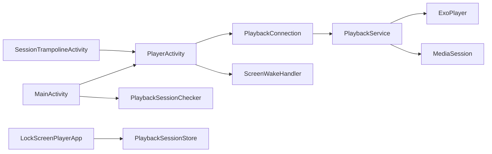
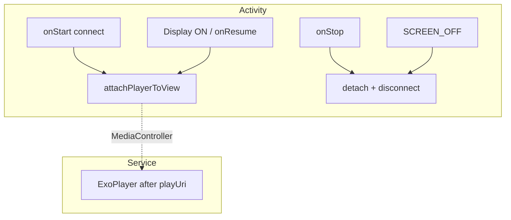

# LockScreenPlayer Project Guide

> Functional spec: [FUNCTIONAL_SPEC.md](./FUNCTIONAL_SPEC.md)  
> Version: v0.1.0

---

## 1. Directory layout

```
LockScreenPlayer/
├── docs/
│   ├── FUNCTIONAL_SPEC.md
│   └── PROJECT_SKELETON.md
├── app/
│   └── src/main/
│       ├── AndroidManifest.xml
│       ├── res/
│       │   ├── layout/              # activity_main, activity_player, bottom_sheet_settings
│       │   ├── values/              # English
│       │   ├── values-zh-rTW/
│       │   ├── values-ja/
│       │   ├── xml/locales_config.xml
│       │   └── drawable/
│       └── java/com/lockscreen/player/
│           ├── LockScreenPlayerApp.kt
│           ├── MainActivity.kt
│           ├── locale/
│           │   ├── AppLanguage.kt
│           │   └── LocalePreference.kt
│           ├── ui/
│           │   ├── SettingsBottomSheetFragment.kt
│           │   └── LanguagePickerDialogFragment.kt
│           ├── player/
│           │   ├── PlayerActivity.kt
│           │   └── ScreenWakeHandler.kt
│           └── playback/
│               ├── PlaybackService.kt
│               ├── PlaybackConnection.kt
│               ├── PlaybackSessionStore.kt
│               ├── PlaybackSessionChecker.kt
│               ├── UriPlaybackAccess.kt
│               ├── RepeatModePreference.kt      # + VideoRepeatMode enum
│               ├── MediaArtworkLoader.kt
│               └── SessionTrampolineActivity.kt
├── build.gradle.kts
├── settings.gradle.kts
└── gradle.properties
```

---

## 2. Module dependencies



---

## 3. Key classes

| Class | Path | Role |
|-------|------|------|
| `PlaybackService` | `playback/PlaybackService.kt` | `MediaSessionService`; lazy `ExoPlayer`; `isRunning` / `isPlaybackReady` |
| `PlaybackConnection` | `playback/PlaybackConnection.kt` | Async `MediaController`; `onConnectionFailed` |
| `PlaybackSessionStore` | `playback/PlaybackSessionStore.kt` | URI / title in SharedPreferences; `hasActiveSession()` |
| `PlaybackSessionChecker` | `playback/PlaybackSessionChecker.kt` | Background URI readability check |
| `UriPlaybackAccess` | `playback/UriPlaybackAccess.kt` | `canRead` / `canReadAsync` |
| `PlayerActivity` | `player/PlayerActivity.kt` | `PlayerView`, URI loading overlay, connection retry, broadcasts |
| `ScreenWakeHandler` | `player/ScreenWakeHandler.kt` | `DisplayManager` + `SCREEN_OFF` |
| `SessionTrampolineActivity` | `playback/SessionTrampolineActivity.kt` | Notification / lock screen card entry |
| `MediaArtworkLoader` | `playback/MediaArtworkLoader.kt` | First video frame → notification / lock screen artwork |

---

## 4. Lifecycle and PlayerView binding

**Core rule**: Do **not** `release` or stop `ExoPlayer` in `Activity.onStop`; only detach `PlayerView`.

| Event | PlayerActivity | PlaybackService |
|-------|----------------|-----------------|
| `onStart` | `connect()`, register receivers, `ScreenWakeHandler.register` | Keep or start playback |
| `onResume` / window focus | `attachPlayerToView()` | Keep playing |
| `onStop` | `detachPlayerFromView()`, `disconnect()` | Keep playing |
| Display `STATE_ON` | `attachPlayerToView()` | Keep playing |
| `SCREEN_OFF` | `detachPlayerFromView()` | Keep playing |
| End (play once) / `ACTION_STOP_PLAYBACK` / URI read fail | Finish or Toast | `stopForegroundAndSelf()` or `failPlaybackUri()` |
| `onDestroy` (Service) | — | `markServiceInactive()` keeps URI; normal end uses `clear()` |



---

## 5. Service state flags

| Flag | Meaning |
|------|---------|
| `PlaybackService.isRunning` | Service instance `onCreate`–`onDestroy` |
| `PlaybackService.isPlaybackReady` | `playUri` successfully called `setMediaItem` |
| `PlaybackSessionStore.hasActiveSession()` | Foreground playback (`service_active` + URI) |

`LockScreenPlayerApp.onCreate` calls `PlaybackSessionStore.restore()` and reconciles drift with `isRunning`.

---

## 6. In-app broadcasts (package-scoped)

| Action | When sent | Receiver |
|--------|-----------|----------|
| `ACTION_PLAYBACK_URI_FAILED` | Service cannot read URI | `PlayerActivity`: Toast + `finish()` |
| `ACTION_PLAYBACK_SESSION_UPDATED` | `clear()` / normal playback stop | `MainActivity`: refresh Resume button |

---

## 7. Build and run

### 7.1 Requirements

- Android Studio (supports **AGP 9.1.1**)
- JDK 17
- Android SDK Platform 36 (compileSdk)

### 7.2 Commands

```powershell
.\gradlew.bat assembleDebug
.\gradlew.bat installDebug
```

### 7.3 First-run checklist

1. Grant notification permission (Android 13+).
2. Pick a video → play → lock 30s → audio should not stop.
3. Wake screen → video frame visible.
4. Back to home → **Resume playback** → returns to player.
5. Force-stop app → relaunch → resume works if URI permission still valid.

---

## 8. Extension guide

| Need | Suggested change |
|------|------------------|
| Playlist | `PlaybackService` + `ConcatenatingMediaSource` |
| Remember position | `DataStore` + `Player.Listener` |
| Audio (MP3) | `OpenDocument` MIME + artwork fallback in `MediaArtworkLoader` |
| Unit tests | `PlaybackSessionStore`, `UriPlaybackAccess`, `VideoRepeatMode` |
| Release shrinking | `proguard-rules.pro` + Media3 keep rules |

---

## 9. Known limitations (v0.1)

- Picker is `video/*`; pure audio not officially supported.
- No playlist; no position persistence.
- Some ROMs may show a brief black frame when restoring video on lock screen.
- `allowBackup=true`; use `backupRules` to exclude stale URIs if needed.
- No dedicated Stop button; back key, end of playback, or decode error stops the service.

---

## 10. Links

- [Media3 documentation](https://developer.android.com/media/media3)
- [MediaSessionService](https://developer.android.com/media/media3/session/sessions)
- [Show activity on lock screen](https://developer.android.com/training/scheduling/wakelock#show-when-locked)
